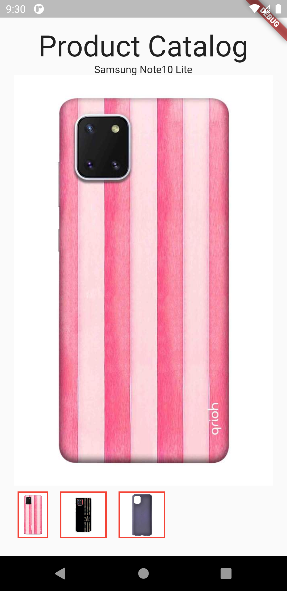
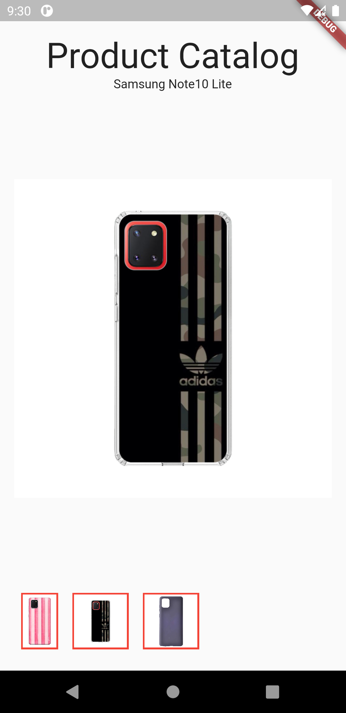
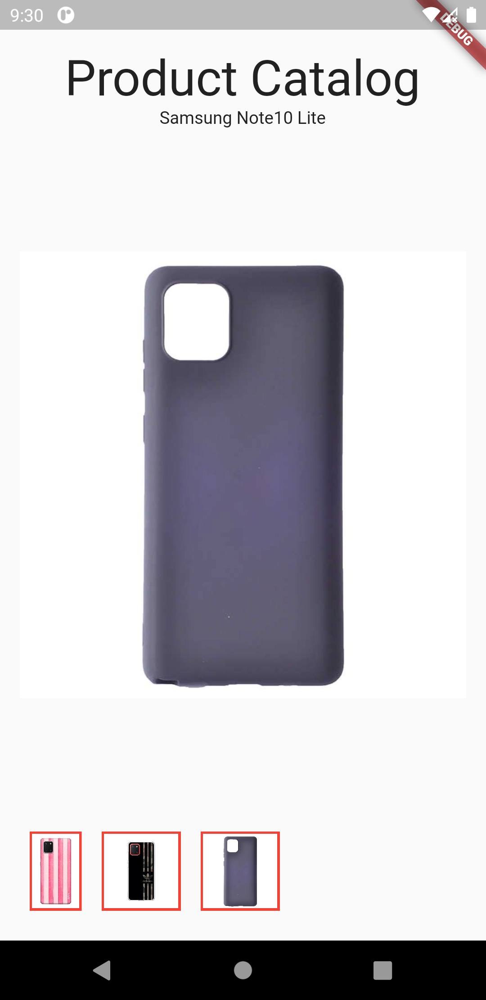

# interactivewidget

A new Flutter project.

We are using List view Builder for this project

A Simple Project showing the implementation of product catalog for Ecommerce apps

We have image preview at the bottom showing the images on selecting the images from the bottom the the image is shown on the screen

